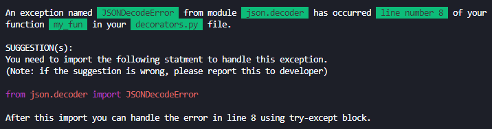

# Introduction

Exception handling is one of the most cruicial part of the coding practices. And it is always a good idea to handle the specific exception using try-except rather than just handling the *Exception* class in Python. This package can help you achieve the same.

# Steps

1. Install the package using `pip install know-your-exceptions`
2. Import the decorator in your file using `from know_your_exceptions.decorators import exc_finder`
3. Add this decorator over your function, and make sure that you function does not have any *try-except* block (so that this package can suggest you accurate exception handling method)

# Example Response

